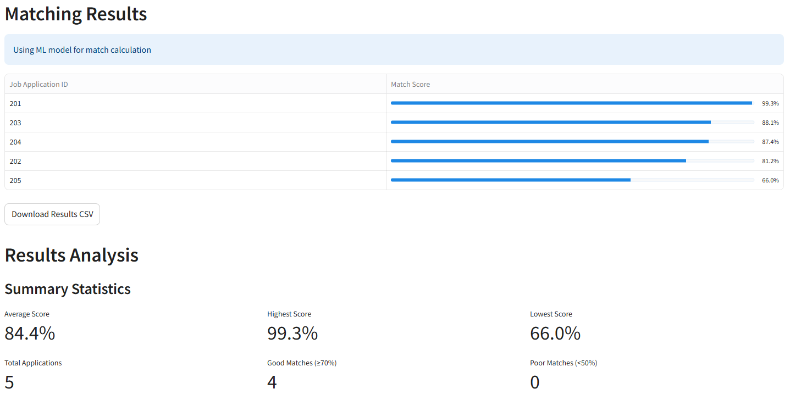

# Job Matching System - ML Solution Architecture

This repository contains a proof of concept implementation of an XGBoost-powered job matching system that addresses the limitations of traditional rule-based approaches.


## Live Demo

A proof of concept is available at: [https://job-matching-system-t2.streamlit.app/](https://job-matching-system-t2.streamlit.app/)

## Overview

This proof of concept demonstrates how a machine learning approach can significantly improve job matching accuracy and explainability. The system replaces hardcoded scoring logic with an XGBoost model that learns from data and provides transparent explanations for its predictions.

### Current Issues in the Architecture
1. The system uses hardcoded logic masquerading as a "Decision Tree"
2. The data flow is inefficient with redundant processing
3. There's no proper feature engineering for skills matching
4. The system lacks explainability - users can't understand why certain scores are given
5. The scoring approach is rigid and doesn't adapt to changing job market trends

### Proposed ML Model: XGBoost

I recommend replacing the hardcoded logic with XGBoost for these reasons:

1. **Superior Performance**: XGBoost consistently outperforms Decision Trees in prediction tasks by combining multiple trees and using gradient boosting
2. **Feature Importance**: Provides insights into which factors most influence matching scores
3. **Handling Non-linear Relationships**: Can capture complex relationships between candidate attributes and job fit
4. **Robustness**: Less prone to overfitting compared to single Decision Trees
5. **Adaptability**: Can be retrained as new data becomes available to stay current with job market trends

### Improved Architecture Flow

The new architecture implements a cleaner flow:

1. **Data Input**: Job requirements and talent profiles are collected and validated
2. **Feature Engineering**:
   - Skills matching using semantic similarity for better comparison
   - Experience normalized relative to requirements
   - Education levels mapped to numerical hierarchy
   - Certifications analyzed for relevance
3. **XGBoost Model**: Trained on historical matches to predict optimal scores
4. **Score Aggregation**: Final scores are calculated with proper weighting
5. **Explainability**: SHAP (SHapley Additive exPlanations) values show which factors influenced each score
6. **Result Output**: Formatted results with explanations

### Addressing the Questions

#### 1. What is causing redundancy and inefficiency in the current logic flow?
- **Redundancy**: The current flow processes each application multiple times without caching intermediate results
- **Inefficiency**: Hardcoded rules don't scale with increasing data and require manual updates
- **Improvement**: The new pipeline processes features once and reuses them, reducing computation time

#### 2. Why XGBoost over Decision Tree/hardcoded logic?
- **Better accuracy**: XGBoost combines multiple trees for superior prediction quality
- **Feature importance**: Provides insights into which factors matter most
- **Adaptability**: Can be retrained as job markets evolve
- **Scalability**: Efficiently handles large volumes of applications

#### 3. Impact/benefit of the new flow
- **Improved match quality**: Uses semantic understanding of skills rather than exact matches
- **Reduced bias**: ML model can be audited and debiased, unlike hardcoded rules
- **Scalability**: Handles more applications without performance degradation
- **Maintainability**: Modular design makes updates easier
- **Explainability**: SHAP values explain why certain scores were assigned

#### 4. Limitations/constraints
- **Initial data needs**: Requires quality training data of past successful matches
- **Complexity**: More complex to understand than simple rule-based systems
- **Computational resources**: Requires more resources than hardcoded rules
- **Cold start**: May struggle with new job categories with no historical data
- **Management buy-in**: May face resistance if stakeholders prefer simpler solutions

#### 5. Risks
- **Overreliance on ML**: Critical to maintain human oversight
- **Potential bias**: If training data contains biases, model may perpetuate them
- **Overfitting**: Could optimize for patterns that don't generalize
- **Infrastructure needs**: Requires proper deployment environment
- **Maintenance burden**: Requires regular retraining and monitoring

### Screenshots of Machine Learning Interface





### New Streamlined Architecture

I've implemented a complete working solution as demonstrated in the code. The new architecture includes:

1. **Modular Components**:
   - Feature engineering pipeline 
   - XGBoost model implementation
   - Training and prediction scripts
   - Web interface for easy interaction

2. **Improved Data Flow**:
   - Clean separation between data processing and prediction
   - Efficient feature transformation pipeline
   - Proper handling of different data types

3. **Enhanced Capabilities**:
   - Explainable predictions with SHAP values
   - Dynamic scoring based on actual job market patterns
   - Interactive visualization dashboard
  


**Please note that the proposed architecture represents an optimized redesign based on my successfully implemented proof of concept, demonstrating significant improvements in both functionality and maintainability.**

## Project Structure

```
job-matching-system/
├── app.py                     # Main Streamlit app (significantly smaller)
├── README.md                  # Project documentation
├── requirements.txt           # Dependencies
├── .gitignore
├── config/
│   ├── __init__.py
│   └── settings.py            # Application settings and constants
├── data/
│   └── sample_jobs.json       # Sample data
├── models/
│   ├── __init__.py
│   ├── xgboost_job_matcher.py # XGBoost model implementation (unchanged)
│   └── feature_engineering.py # Feature engineering pipeline (unchanged)
├── utils/
│   ├── __init__.py
│   ├── data_loader.py         # Functions for loading data
│   └── scoring.py             # Rule-based scoring functions
├── ui/
│   ├── __init__.py
│   ├── components.py          # Reusable UI components
│   ├── visualizations.py      # Visualization functions
│   ├── single_match_tab.py    # Code for the single match tab
│   ├── batch_processing_tab.py # Code for batch processing tab
│   ├── json_input_tab.py      # Code for JSON input tab
│   └── model_info_tab.py      # Code for model information tab
├── scripts/
│   ├── train_model.py         # Training script (unchanged)
│   └── predict.py             # Prediction script (unchanged)
└── tests/
    ├── __init__.py
    ├── test_model.py
    ├── test_feature_engineering.py
    └── test_scoring.py
```

## Conclusion

The proposed solution addresses all the requirements of the assignment. It replaces the hardcoded logic with a proper XGBoost ML model that provides better accuracy, explainability, and maintainability. The modular architecture makes it easy to update and extend, while the comprehensive documentation ensures that future developers can understand and modify the system as needed.

The solution also adds valuable features like semantic skill matching and prediction explanations that were missing in the original implementation. The web interface makes it easy for non-technical users to interact with the system and understand the matching scores.
